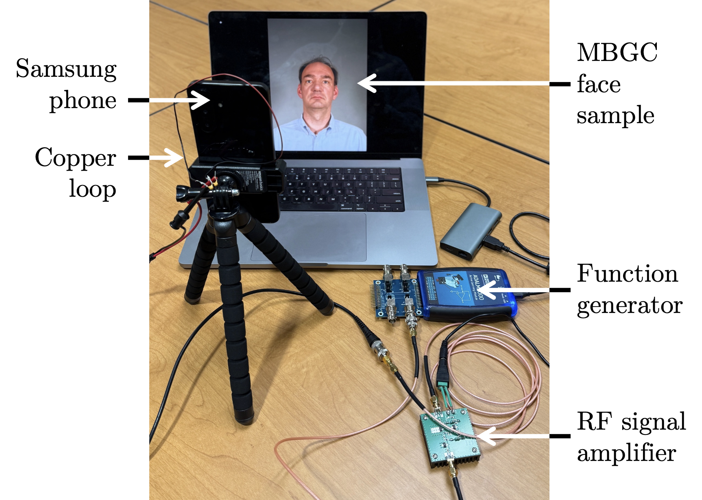
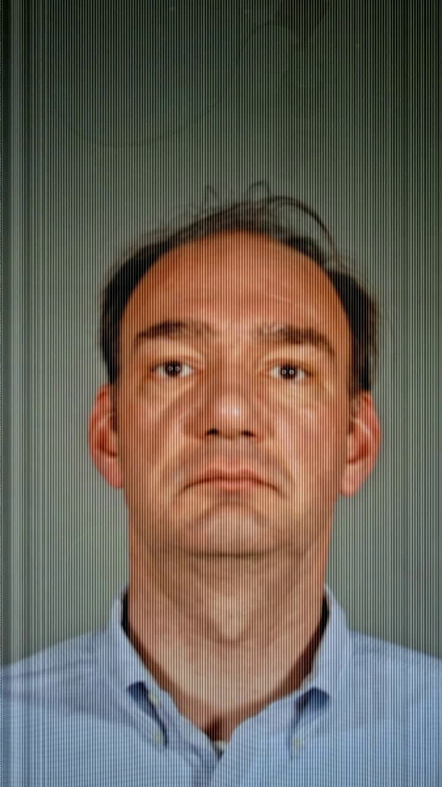
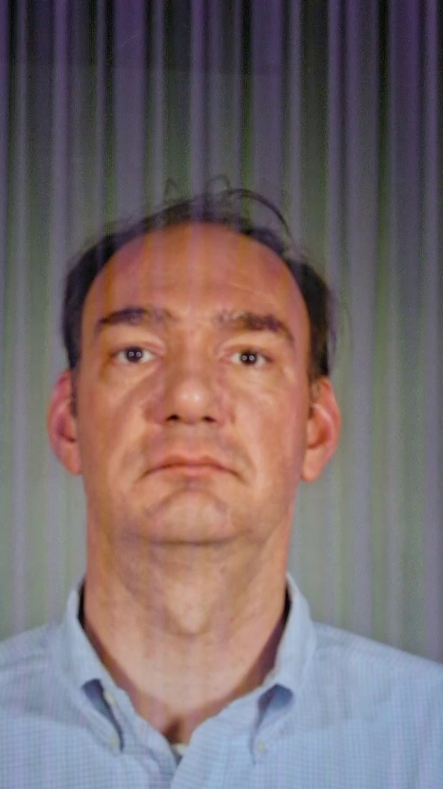

# Intentional Electromagnetic Interference Attacks on Facial Recognition

Official GitHub repository for the paper: Tyler Fitzsimmons and Adam Czajka, "Intentional Electromagnetic Interference Attacks on Facial Recognition," IEEE/IAPR International Joint Conference on Biometrics, Rome, Italy, September 1-4, 2026 **([ArXiv](https://arxiv.org/abs/2607.15512) | [IEEEXplore]())**


## Table of contents
* [Abstract](#abstract)
* [Datasets](#datasets)
* [Model Script](#modeling)
* [Citation](#citation)
* [Acknowledgment](#acknowledgment)

<a name="abstract"/></a>
## 📌 Abstract

Attacks on general computer vision algorithms are often relegated to the digital domain, with the optimization performed purely in the digital world and then translated to physical mediums for implementation. In the field of
biometrics, including facial recognition, physical presentation attacks targeting biometric sensors are dominant and present significant opportunity and risk. This paper highlights a critical vulnerability in the physical-to-digital pipeline of biometric sensors and provides a standardized approach for testing facial recognition system robustness against hardware attacks, going beyond and potentially complementing presentation attacks (as defined in ISO/IEC 30107 standard series). Specifically, in this work we (a) demonstrate that intentional electromagnetic interference
is possible to be conducted with commonly accessible radio frequency (RF) equipment, (b) assess the robustness of state-of-the-art face recognition methods against RF-based attacks, and (c) provide a dataset composed of face images captured with and without electromagnetic interference to serve as a new benchmark for testing modern face matchers against RF-sourced interference.

<p align="center">
  
</p>

<a name="datasets"/></a>
## 📀 Datasets

### IEMI Attack Dataset
We provide a new dataset of face videos representing 50 identities, recaptured from MBGC (Multiple Biometric Grand Challenge) V2, by a camera under the IEMI attack along with recaptured videos without the IEMI attack, to serve as a new benchmark for testing reliability of face recognition models. There are four folders contained in the dataset: Original identities, Clean identities, Physical Attack identities, and Digital Attack identities. If desired, please acquire the original MBCG v2 dataset for full testing purposes. 

<p align="center">
  
  
  
  
  <br>
  <i>(a) Original MBCG v2 Image (top left), (b) Clean Image (top right), (c) Modeled Attack (bottom left), (d) Physical Attack (bottom right)</i>
</p>


### Obtaining Copies of the Datasets
Instructions on how to request a copy of the data can be found at [the CVRL webpage](https://cvrl.nd.edu/projects/data/).

<a name="modeling"/></a>

## 🚀 IEMI Modeling Script
- Linux / Windows / macOS
- Python 3.9+
- CUDA (optional)
  
There are only two scripts necessary for the IEMI Modeling.
- RF_Optimization.py: Runs a grid search over provided parameters to determine theoretically optimal RF settings per model (models built in same as IJCB paper).

- RF_effect_modeling: Using the outputs from RF_Optimization.py, the script overlays the desired RF parameters (frequency, amplitude, bar angle, AM effect, FM effect) onto a directory of images.

It should also be noted the modeling is not intended to be an optimized adversarial attack. There are no machine learning models included in the modeling script. The goal is to simply generate images that have a level of qualitative disruption to provide a narrowed focus for the real-world physical attacks.


<a name="citation"/></a>
### Citation

If you find this work useful in your research, please cite the following paper:
```
@inproceedings{fitzsimmonsIJCB2026,
      title={Intentional Electromagnetic Interference Attacks on Facial Recognition}, 
      author={Tyler Fitzsimmons and Adam Czajka},
      year={2026},
      booktitle={IEEE/IAPR International Joint Conference on Biometrics, Rome, Italy, September 1-4, 2026},
}
```

<a name="acknowledgment"/></a>
### Acknowledgment
This material is based upon work partially supported by the OUSW/R\&E (Office of the Under Secretary of War, Research and Engineering), National Defense Education Program (NDEP) SMART Scholarship Program, and Naval Surface Warfare Center (NSWC), Crane Division Ph.D. Fellowship Program. Any opinions, findings, and conclusions or recommendations expressed in this material are those of the authors and do not necessarily reflect the views of the DoW or U.S. Navy.
